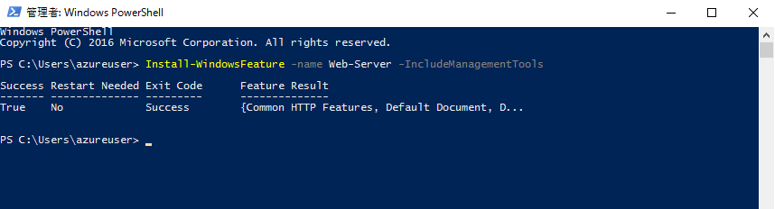
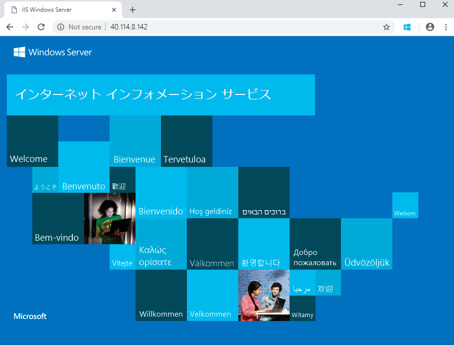

---
wts:
  title: 01 - ポータルで仮想マシンを作成する (10 分)
  module: Module 02 - Core Azure Services (Workloads)
---
# <a name="01---create-a-virtual-machine-in-the-portal-10-min"></a>01 - ポータルで仮想マシンを作成する (10 分)

このチュートリアルでは、Azure portal で仮想マシンを作成し、仮想マシンに接続し、Web サーバー ロールをインストールしてテストします。 

**注**:このチュートリアルでは、情報アイコンをクリックして読む時間を設けてください。 

# <a name="task-1-create-the-virtual-machine"></a>タスク 1:仮想マシンを作成する 
1. Azure portal ( **https://portal.azure.com** ) にサインインします。

3. ポータル メニューの **[すべてのサービス]** ブレードから、 **[仮想マシン]** を検索して選択し、 **[+ 作成]** をクリックし、ドロップダウンから **[+ Azure 仮想マシン]** を選択します。

4. **[基本]** タブで、次の情報を入力します (その他の情報は既定値のままにします)。

    | 設定 | 値 |
    |  -- | -- |
    | サブスクリプション | **提供された既定値を使用する** |
    | Resource group | **新しいリソース グループの作成** |
    | 仮想マシン名 | **myVM** |
    | リージョン | **(米国) 米国東部**|
    | 可用性のオプション | インフラストラクチャの冗長性オプションは必要ありません|
    | Image | **Windows Server 2019 Datacenter - Gen2**|
    | サイズ | **Standard D2s v3**|
    | 管理者アカウントのユーザー名 | **azureuser** |
    | 管理者アカウントのパスワード (慎重に入力してください!) | **Pa$$w0rd1234**|
    | 受信ポートの規則 - | **選択したポートを許可する**|
    | 受信ポートの選択 | **RDP (3389)** と **HTTP (80)**| 

5. ネットワーク タブに切り替えて、**受信ポートの選択** セクションで **HTTP (80) と RDP (3389)** が選択されていることを確認します。

6. [管理] タブに切り替え、 **[監視]** セクションで次の設定を選択します。

    | 設定 | 値 |
    | -- | -- |
    | ブート診断 | **無効化**|

7. 残りの値の既定値はそのままにして、ページの下部にある **[確認および作成]** ボタンをクリックします。

8. Once Validation is passed click the <bpt id="p1">**</bpt>Create<ept id="p1">**</ept> button. It can take anywhere from five to seven minutes to deploy the virtual machine.

9. デプロイ ページ上と **[通知]** 領域 (トップ メニュー バーのベル アイコン) を通して更新を受信します。

# <a name="task-2-connect-to-the-virtual-machine"></a>タスク 2:仮想マシンに接続する

このタスクでは、RDP (リモート デスクトップ プロトコル) を使用して新しい仮想マシンに接続します。 

1. 上部の青いツール バーからベル アイコンをクリックし、展開が成功したら [リソースに移動] を選択します。 

    **注**:デプロイ ページの **リソースに移動** リンクを使用することもできます。 

2. 仮想マシンの **[概要]** ブレードで、 **[接続]** ボタンをクリックして、ロドロップ ダウンから **[RDP]** を選びます。

    ![[接続] ボタンが強調表示された仮想マシンのプロパティのスクリーンショット。](../images/0101.png)

    <bpt id="p1">**</bpt>Note<ept id="p1">**</ept>: The following directions tell you how to connect to your VM from a Windows computer. On a Mac, you need an RDP client such as this Remote Desktop Client from the Mac App Store and on a Linux computer you can use an open source RDP client.

2. On the <bpt id="p1">**</bpt>Connect to virtual machine<ept id="p1">**</ept> page, keep the default options to connect with the public IP address over port 3389 and click <bpt id="p2">**</bpt>Download RDP File<ept id="p2">**</ept>. A file will download on the bottom left of your screen.

3. ダウンロードした RDP ファイル (ラボ マシンの左下にあります) を**開き**、プロンプトが表示されたら **[接続]** をクリックします。 

    ![[接続] ボタンが強調表示された仮想マシンのプロパティのスクリーンショット。 ](../images/0102.png)

4. **[Windows セキュリティ]** ウィンドウで、VM **azureuser** の作成時に使用した管理者資格情報とパスワード **Pa$$w0rd1234** を使用してサインインします。 

5. You may receive a warning certificate during the sign-in process. Click <bpt id="p1">**</bpt>Yes<ept id="p1">**</ept> or to create the connection and connect to your deployed VM. You should connect successfully.

    ![[はい] ボタンが強調表示された、信頼できない証明書をユーザーに通知する証明書警告ダイアログのスクリーンショット。 ](../images/0104.png)

A new Virtual Machine (myVM) will launch inside your Lab. Close the Server Manager and dashboard windows that pop up (click "x" at top right). You should see the blue background of your virtual machine. <bpt id="p1">**</bpt>Congratulations!<ept id="p1">**</ept> You have deployed and connected to a Virtual Machine running Windows Server. 

# <a name="task-3-install-the-web-server-role-and-test"></a>タスク 3:Web サーバー ロールをインストールしてテストする

このタスクでは、作成した仮想マシンのサーバーに Web サーバーのロールをインストールし、デフォルトの IIS ウェルカム ページが表示されることを確認します。 

1. 新しく開いた仮想マシンで、検索バーで **PowerShell** を検索して PowerShell を起動します。見つかったら、**Windows PowerShell**を右クリックして**管理者として実行します**。

    ![[スタート] ボタンがクリックされ、管理者として実行された PowerShell が強調表示された仮想マシン デスクトップのスクリーンショット。](../images/0105.png)

2. In PowerShell, install the <bpt id="p1">**</bpt>Web-Server<ept id="p1">**</ept> feature on the virtual machine by running the following command. (Paste in the command and hit ENTER for the installment to begin).

    ```PowerShell
    Install-WindowsFeature -name Web-Server -IncludeManagementTools
    ```
  
3. When completed, a prompt will state <bpt id="p1">**</bpt>Success<ept id="p1">**</ept> with a value <bpt id="p2">**</bpt>True<ept id="p2">**</ept>. You do not need to restart the virtual machine to complete the installation. Close the RDP connection to the VM by clicking the <bpt id="p1">**</bpt>x<ept id="p1">**</ept> on the blue bar at the top center of your virtual machine. You can also minimize it by clicking the <bpt id="p1">**</bpt><ph id="ph1">-</ph><ept id="p1">**</ept> on the blue bar at the top center.

    

4. ポータルに戻り、myVM の **[概要]** ブレードに移動し、 **[クリップボードにコピー]** ボタンを使用して myVM のパブリック IP アドレスをコピーし、新しいブラウザー タブを開いてパブリック IP アドレスを URL テキスト ボックスに貼り付け、**Enter** キーを押して閲覧します。

    

5. IIS Web サーバーの既定のウェルカム ページが表示されます。

    

<bpt id="p1">**</bpt>Congratulations!<ept id="p1">**</ept> You have created a new VM running a web server that is accessible via its public IP address. If you had a web application to host, you could deploy application files to the virtual machine and host them for public access on the deployed virtual machine.


<bpt id="p1">**</bpt>Note<ept id="p1">**</ept>: To avoid additional costs, you can optionally remove this resource group. Search for resource groups, click your resource group, and then click <bpt id="p1">**</bpt>Delete resource group<ept id="p1">**</ept>. Verify the name of the resource group and then click <bpt id="p1">**</bpt>Delete<ept id="p1">**</ept>. Monitor the <bpt id="p1">**</bpt>Notifications<ept id="p1">**</ept> to see verify that the deletion completed successfully. 
