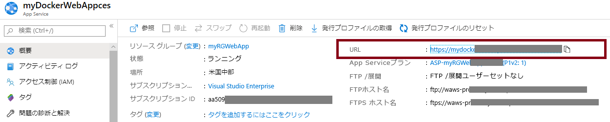

---
wts:
  title: 02 - Web アプリの作成 (10 分)
  module: Module 02 - Core Azure Services (Workloads)
---
# 02 - Web アプリの作成 (10 分)

In this walkthrough, we will create a web app that runs a Docker container. The Docker container contains a Welcome message. 

Azure App Service are actually a collection of four services, all of which are built to help you host and run web applications. The four services (Web Apps, Mobile Apps, API Apps, and Logic Apps) look different, but in the end they all operate in very similar ways. Web Apps are the most commonly used of the four services, and this is the service that we will be using in this lab.

# タスク 1:Web アプリを作成する 

このタスクでは、Azure App Service Web App を作成します。 

1. [Azure ポータル](http://portal.azure.com/)にサインインします。 

2. **[すべてのサービス]** ブレードで「**App Services**」を検索して選択し、**[+ 追加]、[+ 作成]、[+ 新規]** のいずれかをクリックします。

3. On the <bpt id="p1">**</bpt>Basics<ept id="p1">**</ept> tab of the <bpt id="p2">**</bpt>Web App<ept id="p2">**</ept> blade, specify the following settings (replace <bpt id="p3">**</bpt>xxxx<ept id="p3">**</ept> in the name of the web app with letters and digits such that the name is globally unique). Leave the defaults for everything else, including the App Service Plan. 

    | 設定 | 値 |
    | -- | -- |
    | サブスクリプション | **提供された既定値を使用する** |
    | リソース グループ | **新しいリソース グループの作成**|
    | Name | **myDockerWebAppxxxx** |
    | 発行 | **Docker コンテナー** |
    | オペレーティング システム | **Linux** |
    | リージョン | **米国東部** |
    
    **注:**  **xxxx** を変更して、Web アプリ名が一意になるようにしてください。

4. **[次へ]、[Docker]** の順にクリックし、コンテナー情報を構成します。  

    | 設定 | 値 |
    | -- | -- |
    | オプション | **[単一コンテナー]** |
    | イメージのソース | **Docker Hub** |
    | アクセスの種類 | **Public** |
    | [Image and tag](イメージとタグ) | **mcr.microsoft.com/azuredocs/aci-helloworld** |
    
 **注:**  startup コマンドはオプションで、この演習では必要ありません。

5. **[確認と作成]** をクリックし、**[作成]** をクリックします。 

# タスク 2:Web アプリをテストする

このタスクでは、Web アプリをテストします。

1. Web アプリがデプロイされるのを待ちます。

2. **[通知]** の **[リソースに移動]** をクリックします。 

3. このチュートリアルでは、Docker コンテナーを実行する Web アプリを作成します。

    

4. In a new browser window, paste the URl and press enter. The Welcome to Azure Container Instances! welcome message will be displayed.

    

5. Azure App Service は、実際には 4 つのサービスのコレクションであり、そのすべてが Web アプリケーションのホストと実行を支援するために構築されています。 

4 つのサービス (Web アプリ、モバイル アプリ、API アプリ、ロジック アプリ) は外観が異なりますが、最終的にはすべて非常によく似た方法で動作します。

これで、Azure App Service を作成しました。
