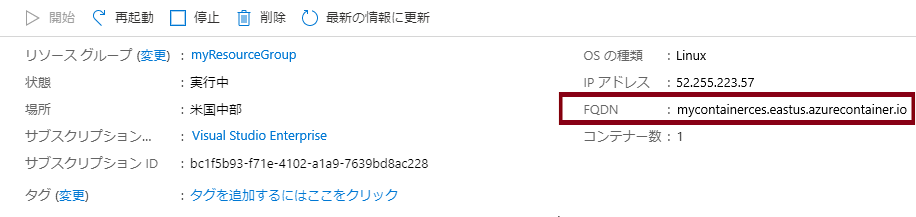
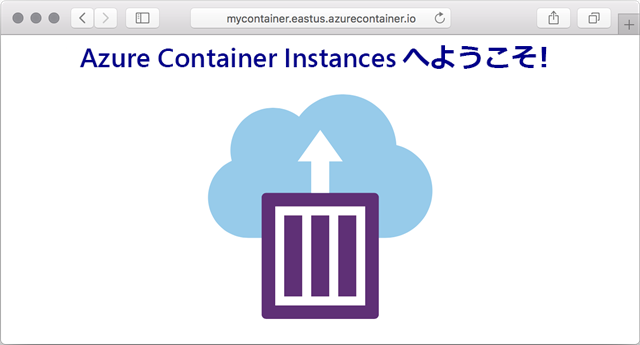

---
wts:
  title: 03 - Azure Container Instances をデプロイする (10 分)
  module: Module 02 - Core Azure Services (Workloads)
---

# 03 - Azure Container Instances をデプロイする (10 分)

In this walkthrough we create, configure, and deploy a container by using Azure Container Instances (ACI) in the Azure Portal. The container is a Welcome to ACI web application that displays a static HTML page. 

# タスク 1:コンテナー インスタンスを作成する 

このタスクでは、Web アプリケーションの新しいコンテナー インスタンスを作成します。  

1. [Azure portal](https://portal.azure.com) にサインインします。

2. **[すべてのサービス]** ブレードで「**コンテナー インスタンス**」を検索して選択し、**[+ 追加]、[+ 作成]、[+ 新規]** のいずれかをクリックします。 

3. 新しいコンテナー　インスタンスについて、次の基本的な詳細を入力します (その他の情報は既定値のままにします)): 

    | 設定| 値|
    |----|----|
    | サブスクリプション | ***提供された既定値を使用する*** |
    | Resource group | **新しいリソース グループの作成** |
    | コンテナー名| **mycontainer**|
    | リージョン | **(米国) 米国東部** |
    | イメージのソース| **Docker Hub またはその他のレジストリ**|
    | イメージの種類| **Public**|
    | Image| **mcr.microsoft.com/azuredocs/aci-helloworld**|
    | OS の種類| **Linux** |
    | サイズ| ***既定値のままにする***|

4. Configure the Networking tab (replace <bpt id="p1">**</bpt>xxxxx<ept id="p1">**</ept> with letters and digits such that the name is globally unique). Leave all other settings at their default values.

    | 設定| 値|
    |--|--|
    | DNS 名ラベル| **mycontainerdnsxxxxx** |

    
    <bpt id="p1">**</bpt>Note<ept id="p1">**</ept>: Your container will be publicly reachable at dns-name-label.region.azurecontainer.io. If you receive a <bpt id="p1">**</bpt>DNS name label not available<ept id="p1">**</ept> error message following the deployment, specify a different DNS name label (replacing the xxxxx) and re-deploy. 

5. **[確認と作成]** を選択して、自動検証プロセスを開始します。

6. **[作成]** を選択してコンテナー インスタンスを作成します。 

7. デプロイ ページと **[通知]** ページを監視します。 

# タスク 2:コンテナー インスタンスのデプロイを確認する

このタスクでは、ウェルカム ページが表示されることを確認して、コンテナー インスタンスが実行されていることを確認します。

1. デプロイが完了したら、[デプロイ] ブレードで **[リソースに移動]** リンクを使用するか、[通知] 領域でリソースにリンクします。

2. **mycontainer** の **[概要]** ブレードで、**[状態]** が **[実行中]** であることを確認します。 

3. 完全修飾ドメイン名 (FQDN) を見つけます。

    

2. このチュートリアルでは、Azure portal で Azure Container Instances (ACI) を使用して、コンテナーを作成、構成、デプロイします。 

    

このコンテナーは、静的な HTML ページを表示する「ACI Web アプリケーションへようこそ」です。

<bpt id="p1">**</bpt>Note<ept id="p1">**</ept>: To avoid additional costs, you can optionally remove this resource group. Search for resource groups, click your resource group, and then click <bpt id="p1">**</bpt>Delete resource group<ept id="p1">**</ept>. Verify the name of the resource group and then click <bpt id="p1">**</bpt>Delete<ept id="p1">**</ept>. Monitor the <bpt id="p1">**</bpt>Notifications<ept id="p1">**</ept> to see how the delete is proceeding.
