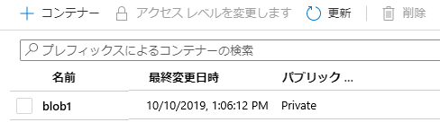

---
wts:
  title: 05 - Blob Storage を作成する (5 分)
  module: Module 02 - Core Azure Services (Workloads)
---
# 05 - Blob Storage を作成する (5 分)

このチュートリアルでは、ストレージ アカウントを作成し、Blob Storage ファイルを操作します。

# タスク 1:ストレージ アカウントを作成する 

このタスクでは、新しいストレージ アカウントを作成します。 

1. Azure portal (<a href="https://portal.azure.com" target="_blank">https://portal.azure.com</a>) にサインインします。

2. **[すべてのサービス]** ブレードで「**ストレージ アカウント**」を検索して選択し、**[+ 追加]、[+ 作成]、[+ 新規]** のいずれかをクリックします。 

3. On the <bpt id="p1">**</bpt>Basics<ept id="p1">**</ept> tab of the <bpt id="p2">**</bpt>Create storage account<ept id="p2">**</ept> blade, fill in the following information (replace <bpt id="p3">**</bpt>xxxx<ept id="p3">**</ept> in the name of the storage account with letters and digits such that the name is globally unique). Leave the defaults for everything else.

    | 設定 | 値 | 
    | --- | --- |
    | サブスクリプション | **提供される既定値のままにする** |
    | Resource group | **新しいリソース グループの作成** |
    | ストレージ アカウント名 | **storageaccountxxxxx** |
    | 場所 | **(米国) 米国東部**  |
    | パフォーマンス | **Standard** |
    | 冗長性 | **ローカル冗長ストレージ (LRS)** |
    
    **注** - **xxxxx** を変更して、一意の**ストレージ アカウント名**となるようにしてください。

5. **[確認と作成]** をクリックして、ストレージ アカウントの設定を確認し、Azure が構成を検証できるようにします。 

6. Once validated, click <bpt id="p1">**</bpt>Create<ept id="p1">**</ept>. Wait for the notification that the account was successfully created. 

7. [ホーム] ページで、「**ストレージ アカウント**」を検索し、新しいストレージ アカウントがリストアップされていることを確認します。

    

# タスク 2:Blob Storage を操作する

このタスクでは、BLOB コンテナーを作成し、BLOB ファイルをアップロードします。 

1. 新しいストレージ アカウントの名前をクリックし、左側のメニューの **[データ ストレージ]** セクションまでスクロールして、 **[コンテナー]** をクリックします。

2. Click <bpt id="p1">**</bpt>+ Container<ept id="p1">**</ept> and complete the information. Use the Information icons to learn more. When done click <bpt id="p1">**</bpt>Create<ept id="p1">**</ept>.

    | 設定 | 値 |
    | --- | --- |
    | Name | **container1**  |
    | パブリック アクセス レベル| **プライベート (匿名アクセスなし)** |
  

    

4. Open a new browser window and search <bpt id="p1">**</bpt>Bing<ept id="p1">**</ept> for an image of a flower. Right click on the image and save it to your VM. 

6. ポータルに戻り、**container1** をクリックして、 **[アップロード]** を選択します。

5. Browse for the image file you just saved on your local computer. Select it and then select upload.

   
6. **[詳細設定]** 矢印をクリックし、既定値のままにしますが、使用可能なオプションを確認してから、**[アップロード]** を選択します。

    <bpt id="p1">**</bpt>Note<ept id="p1">**</ept>: You can upload as many blobs as you like in this way. New blobs will be listed within the container.

7. ファイルがアップロードされたら、ファイルを右クリックして、[表示/編集]、[ダウンロード]、[プロパティ]、[削除] などのオプションを確認します。 

8. 時間があれば、[ファイル]、[テーブル]、[キュー] のオプションを確認します。

# タスク 3:ストレージ アカウントを監視する

1. ストレージ アカウント ブレードに戻り、**[問題に診断と解決]** をクリックします。 

2. Explore some of the most common storage problems. Notice there are multiple troubleshooters here.

3. On the storage account blade, scroll down to the <bpt id="p1">**</bpt>Monitoring<ept id="p1">**</ept> section and click <bpt id="p2">**</bpt>Insights<ept id="p2">**</ept>. Notice there is information on Failures, Performance, Availability, and Capacity. Your information will be different.

    

**[ストレージ アカウントの作成]** ブレードの **[基本]** タブで次の情報を入力します (ストレージ アカウントの名前の **[xxxx]** は、名前がグローバルに一意になるように文字と数字に置き換えます)。

その他は既定値のままにします。
