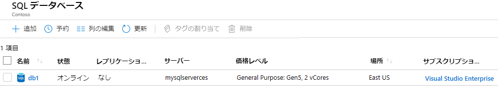
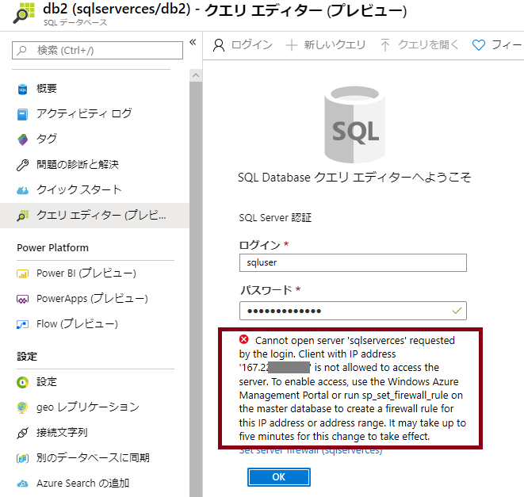
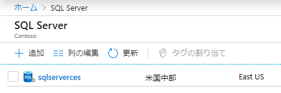
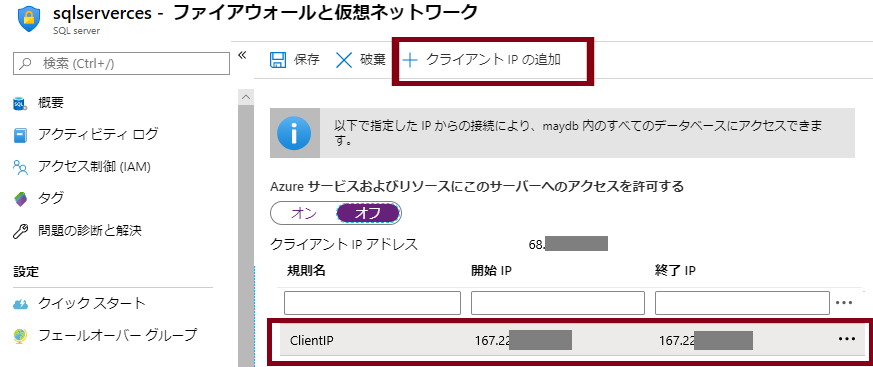
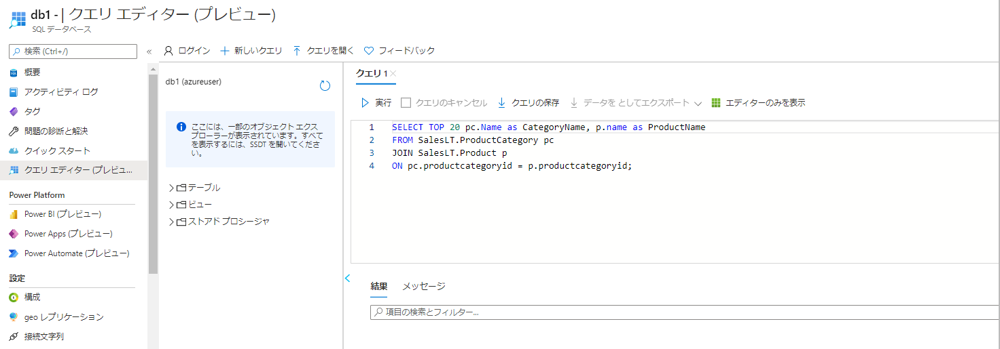

---
wts:
  title: 06 - SQL Database を作成する (5 分)
  module: Module 02 - Core Azure Services (Workloads)
---

# <a name="06---create-a-sql-database-5-min"></a>06 - SQL Database を作成する (5 分)

このチュートリアルでは、Azure で SQL Database を作成し、そのデータベース内のデータをクエリします。

# <a name="task-1-create-the-database"></a>タスク 1:データベースを作成する 

このタスクでは、AdventureWorksLT サンプル データベースに基づいて、SQL データベースを作成します。 

1. [ **https://portal.azure.com** ](https://portal.azure.com) で Azure portal にサインインします。

2. **[すべてのサービス]** ブレードで「**SQL データベース**」を検索して選択し、**[+ 追加]、[+ 作成]、[+ 新規]** のいずれかをクリックします。 

3. **[基本]** タブで、この情報を入力します。  

    | 設定 | 値 | 
    | --- | --- |
    | サブスクリプション | **提供された既定値を使用する** |
    | Resource group | **新しいリソース グループの作成** |
    | データベース名| **db1** | 
    | サーバー | **[新規作成]** を選択する (右側に新しいサイドバーが開きます)|
    | サーバー名 | **sqlserverxxxx** (一意である必要があります) | 
    | 場所 | **(米国) 米国東部** |
    | 認証方法 | **SQL 認証を使用する** |
    | サーバー管理者のログイン | **sqluser** |
    | Password | **Pa$$w0rd1234** |
    | Click  | **[OK]** |

   ![[サーバー] ペインと [新しいサーバー] ペインのスクリーンショット。表に従ってフィールドが入力され、[レビュー + 作成] と [OK] ボタンが強調表示されています。](../images/0501.png)

4. **[ネットワーク]** タブで、次の設定を構成します (その他は既定値のままにしておきます)。 

    | 設定 | 値 | 
    | --- | --- |
    | 接続方法 | **パブリック エンドポイント** |    
    | Azure のサービスとリソースにこのサーバーへのアクセスを許可する | **はい** |
    | 現在のクライアント IP アドレスを追加する | **いいえ** |
    
   ![[SQL Database の作成] ブレードの [ネットワーク] タブのスクリーンショット。テーブルに従って設定が選択され、[確認と作成] ボタンが強調表示されています。](../images/0501b.png)

5. **[セキュリティ]** タブで。 

    | 設定 | 値 | 
    | --- | --- |
    | Microsoft Defender for SQL| **後で** |
    
6. **[追加設定]** タブに移動します。AdventureWorksLT サンプル データベースを使用します。

    | 設定 | 値 | 
    | --- | --- |
    | 既存のデータを使用します | **サンプル** |

    ![[SQL Database の作成] ブレードの [追加設定] タブのスクリーンショット。テーブルに従って設定が選択され、[確認と作成] ボタンが強調表示されています。](../images/0501c.png)

7. Click <bpt id="p1">**</bpt>Review + create<ept id="p1">**</ept> and then click <bpt id="p2">**</bpt>Create<ept id="p2">**</ept> to deploy and provision the resource group, server, and database. It can take approx. 2 to 5 minutes to deploy.


# <a name="task-2-test-the-database"></a>タスク 2:データベースをテストする。

このタスクでは、SQL サーバーを構成し、SQL クエリを実行します。 

1. When the deployment has completed, click Go to resource from the deployment blade. Alternatively, from the <bpt id="p1">**</bpt>All Resources<ept id="p1">**</ept> blade, search and select <bpt id="p2">**</bpt>Databases<ept id="p2">**</ept>, then <bpt id="p3">**</bpt>SQL databases<ept id="p3">**</ept> ensure your new database was created. You may need to <bpt id="p1">**</bpt>Refresh<ept id="p1">**</ept> the page.

    

2. Click the <bpt id="p1">**</bpt>db1<ept id="p1">**</ept> entry representing the SQL database you created. On the db1 blade click <bpt id="p1">**</bpt>Query editor (preview)<ept id="p1">**</ept>.

3. パスワード **Pa$$w0rd1234** を使用して、**sqluser** としてログインします。

4. You will not be able to login. Read the error closely and make note of the IP address that needs to be allowed through the firewall. 

    

5. **[db1]** ブレードに戻り、**[概要]** をクリックします。 

    

6. db1 の **[概要]** ブレードから、概要画面の上部中央にある **[サーバー ファイアウォールの設定]** をクリックします。

7. Click <bpt id="p1">**</bpt>+ Add client IP<ept id="p1">**</ept> (top menu bar) to add the IP address referenced in the error. (it may have autofilled for you - if not paste it into the IP address fields). Be sure to <bpt id="p1">**</bpt>Save<ept id="p1">**</ept> your changes. 

    

8. Return to your SQL database (slide the bottom toggle bar to the left) and click on <bpt id="p1">**</bpt>Query Editor (Preview)<ept id="p1">**</ept>. Try to login again as <bpt id="p1">**</bpt>sqluser<ept id="p1">**</ept> with the password <bpt id="p2">**</bpt>Pa$$w0rd1234<ept id="p2">**</ept>. This time you should succeed. Note that it may take a couple of minutes for the new firewall rule to be deployed. 

9. Once you log in successfully, the query pane appears. Enter the following query into the editor pane. 

    ```SQL
    SELECT TOP 20 pc.Name as CategoryName, p.name as ProductName
    FROM SalesLT.ProductCategory pc
    JOIN SalesLT.Product p
    ON pc.productcategoryid = p.productcategoryid;
    ```

    

10. Click <bpt id="p1">**</bpt>Run<ept id="p1">**</ept>, and then review the query results in the <bpt id="p2">**</bpt>Results<ept id="p2">**</ept> pane. The query should run successfully.

    ![SQL コードが正常に実行され、[結果] ペインに出力が表示されている、データベースのクエリ エディター ペインのスクリーンショット。](../images/0508.png)

Congratulations! You have created a SQL database in Azure and successfully queried the data in that database.

<bpt id="p1">**</bpt>Note<ept id="p1">**</ept>: To avoid additional costs, you can optionally remove this resource group. Search for resource groups, click your resource group, and then click <bpt id="p1">**</bpt>Delete resource group<ept id="p1">**</ept>. Verify the name of the resource group and then click <bpt id="p1">**</bpt>Delete<ept id="p1">**</ept>. Monitor the <bpt id="p1">**</bpt>Notifications<ept id="p1">**</ept> to see how the delete is proceeding.
