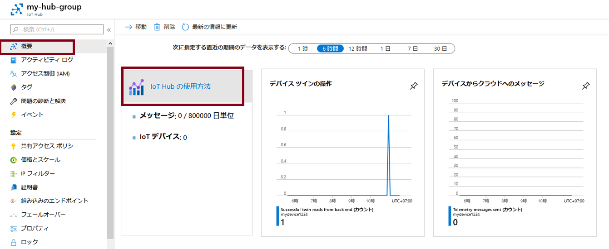

---
wts:
  title: 07 - Azure IoT Hub の実装 (10 分)
  module: 'Module 03: Describe core solutions and management tools'
---
# 07 - Azure IoT Hub の実装 (10 分)

In this walkthrough, we will configure a new Azure IoT Hub in Azure Portal, and then authenticate a connection to an IoT device using the online Raspberry Pi device simulator. Sensor data and messages are passed from the Raspberry Pi simulator to your Azure IoT Hub, and you view metrics for the messaging activity in Azure Portal.

# タスク 1:IoT ハブを作成する 

このタスクでは、IoT ハブを作成します。 

1. [Azure portal](https://portal.azure.com) にサインインします。

2. **[すべてのサービス]** ブレードで「**IoT ハブ**」を検索して選択し、**[+ 追加]、[+ 作成]、[+ 新規]** のいずれかをクリックします。

3. **[IoT ハブ]** ブレードの **[基本]** タブで、フィールドに次の詳細情報を入力します (ストレージ アカウントの名前の **[xxxx]** は、名前がグローバルに一意になるように文字と数字に置き換えます):

    | 設定 | 値 |
    |--|--|
    | サブスクリプション | **提供された既定値を維持する** |
    | リソース グループ | **新しいリソース グループの作成** |
    | IoT Hub 名 | **my-hub-groupxxxxx** |
    | リージョン | **米国東部** |

    **注** - **xxxxx** を変更して、一意の **IoT ハブ名**となるようにしてください。

4. **[管理]** タブに移動し、ドロップダウンを使用して **[価格とスケールティア]** を **[S1:Standard tier]\(S1: Standard レベル\)** に設定します。

5. **[確認および作成]** ボタンをクリックします。

6. **[作成]** ボタンをクリックして、新規 Azure IoT Hub インスタンスの作成を開始します。

7. Azure IoT Hub インスタンスがデプロイされるまで待ちます。 

# タスク 2:IoT デバイスを追加する

このタスクでは、IoT デバイスを IoT ハブに追加します。 

1. When the deployment has completed, click <bpt id="p1">**</bpt>Go to resource<ept id="p1">**</ept> from the deployment blade. Alternatively, from the <bpt id="p1">**</bpt>All services<ept id="p1">**</ept> blade, search for and select <bpt id="p2">**</bpt>IoT Hub<ept id="p2">**</ept> and locate your new IoT Hub instance

    

2. To add a new IoT device, scroll down to the <bpt id="p1">**</bpt>Device management<ept id="p1">**</ept> section and click <bpt id="p2">**</bpt>Devices<ept id="p2">**</ept>. Then, click <bpt id="p1">**</bpt>+ Add Device<ept id="p1">**</ept>.

    

3. センサー データとメッセージが Raspberry Pi シミュレーターから Azure IoT Hub に渡されるので、Azure portal でメッセージング アクティビティのメトリックを表示します。

4. 新しいデバイスが表示されない場合は、[IoT デバイス] ページを**更新**します。 

5. Select <bpt id="p1">**</bpt>myRaspberryPi<ept id="p1">**</ept> and copy the <bpt id="p2">**</bpt>Primary Connection String<ept id="p2">**</ept> value. You will use this key in the next task to authenticate a connection to the Raspberry Pi simulator.

    ![コピー アイコンが強調表示された [プライマリ接続文字列] ページのスクリーンショット。](../images/0603.png)

# タスク 3:Raspberry Pi シミュレーターを使用してデバイスをテストする

このタスクでは、Raspberry Pi シミュレーターを使用してデバイスをテストします。 

1. Open a new tab in the web browser and type this shortcut link <ph id="ph1">https://aka.ms/RaspPi</ph>. It will take you to a Raspberry Pi Simulator site. If you have time, read about the Raspberry Pi simulator. When done select "<bpt id="p1">**</bpt>X<ept id="p1">**</ept>" to close the pop-up window.

2. In the code area on the right side, locate the line with 'const connectionString ='. Replace it with the connection string you copied from the Azure portal. Note that the connection sting includes the DeviceId (<bpt id="p1">**</bpt>myRaspberryPi<ept id="p1">**</ept>) and SharedAccessKey entries.

    

3. Click <bpt id="p1">**</bpt>Run<ept id="p1">**</ept> (below the code area) to run the application. The console output should show the sensor data and messages that are sent from the Raspberry Pi simulator to your Azure IoT Hub. Data and messages are sent each time the Raspberry Pi simulator LED flashes. 

    

5. **[停止]** をクリックするとデータ送信が停止します。

6. Azure Portal に戻ります。

7. Switch the IoT Hub <bpt id="p1">**</bpt>Overview<ept id="p1">**</ept> blade and scroll down to the <bpt id="p2">**</bpt>IoT Hub Usage<ept id="p2">**</ept> information to view usage. Change your timeframe in the <bpt id="p1">**</bpt>show data for last<ept id="p1">**</ept> to see data in the last hour.

    

Congratulations! You have set up Azure IoT Hub to collect sensor data from an IoT device.

<bpt id="p1">**</bpt>Note<ept id="p1">**</ept>: To avoid additional costs, you can optionally remove this resource group. Search for resource groups, click your resource group, and then click <bpt id="p1">**</bpt>Delete resource group<ept id="p1">**</ept>. Verify the name of the resource group and then click <bpt id="p1">**</bpt>Delete<ept id="p1">**</ept>. Monitor the <bpt id="p1">**</bpt>Notifications<ept id="p1">**</ept> to see how the delete is proceeding.
