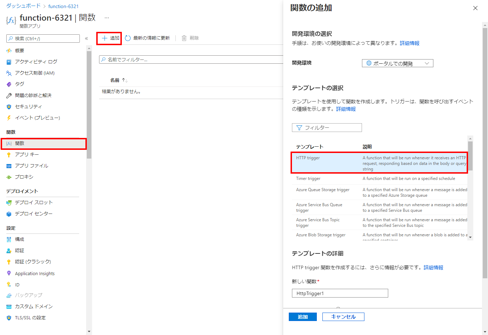
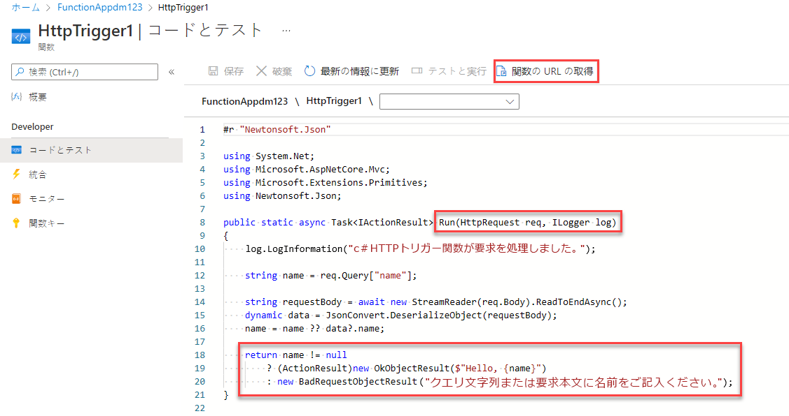
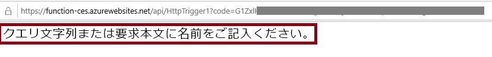
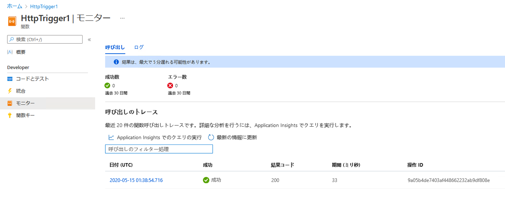

---
wts:
  title: 08 - Azure Functions の実装 (5 分)
  module: 'Module 03: Describe core solutions and management tools'
---
# 08 - Azure Functions の実装 (5 分)

このチュートリアルでは、HTTP 要求がある場合に Hello メッセージを表示する関数アプリを作成します。 

# タスク 1:関数アプリを作成する 

このタスクでは、関数アプリを作成します。

1. [Azure portal](https://portal.azure.com) にサインインします。

2. ポータルの上部にある **[検索]** バーで、「**関数アプリ**」を検索して選択し、**[関数アプリ]** ブレードで **[+ 追加]、[+ 作成]、[+ 新規]** のいずれかをクリックします。

3. **[関数アプリ]** ブレードの **[基本]** タブで次の設定を指定します (関数名の **xxxx** は、名前がグローバルに一意になるように文字と数字に置き換え、その他の設定はすべて既定値のままにしておきます)。 

    | 設定 | 値 |
    | -- | --|
    | サブスクリプション | **提供された既定値を維持する** |
    | Resource group | **新しいリソース グループの作成** |
    | 関数アプリ名 | **function-xxxx** |
    | 発行 | **コード** |
    | ランタイム スタック | **.NET** |
    | Version | **3.1** |
    | リージョン | **米国東部** |

    **注** - **xxxx** を変更して、一意の**関数アプリ名**となるようにしてください。

4. **[確認と作成]** をクリックし、検証が完了したら、**[作成]** をクリックして、新しい Azure 関数アプリのプロビジョニングおよびデプロイを開始します。

5. リソースが作成されたことを示す通知を待ちます。

6. When the deployment has completed, click Go to resource from the deployment blade. Alternatively, navigate back to the <bpt id="p1">**</bpt>Function App<ept id="p1">**</ept> blade, click <bpt id="p2">**</bpt>Refresh<ept id="p2">**</ept> and verify that the newly created function app has the <bpt id="p3">**</bpt>Running<ept id="p3">**</ept> status. 

    ![新しい関数アプリの [関数アプリ] ページのスクリーンショット。](../images/0701.png)

# タスク 2:HTTP トリガー関数を作成してテストします。

このタスクでは、Webhook + API 関数を使用して、HTTP 要求がある場合にメッセージを表示します。 

1. **[関数アプリ]** ブレードで、新しく作成した関数アプリをクリックします。 

2. [関数アプリ] ブレードの **[関数]** セクションで、**[関数]** をクリックしてから、**[+ 追加]、[+ 作成]、[+ 新規]** をクリックします。

    

3. An <bpt id="p1">**</bpt>Add function<ept id="p1">**</ept> pop-up window will appear on the right. In the <bpt id="p1">**</bpt>Select a template<ept id="p1">**</ept> section click <bpt id="p2">**</bpt>HTTP trigger<ept id="p2">**</ept>. Click <bpt id="p1">**</bpt>Add<ept id="p1">**</ept> 

    

4. **[HttpTrigger1]** ブレードの **[開発者]** セクションで、**[コード + テスト]** をクリックします。 

5. On the <bpt id="p1">**</bpt>Code + Test<ept id="p1">**</ept> blade, review the auto-generated code and note that the code is designed to run an HTTP request and log information. Also, notice the function returns a Hello message with a name. 

    

6. 関数エディターの上部のセクションで、**[関数の URL の取得]** をクリックします。 

7. **[キー]** ドロップダウン リストの値が **[既定値]** に設定されていることを確認し、**[コピー]** をクリックして関数の URL をコピーします。 

    

8. Open a new browser tab and paste the copied function URL into your web browser's address bar. When the page is requested the function will run. Notice the returned message stating that the function requires a name in the request body.

    

9. URL の末尾に **&name=*yourname*** を追加します。

    **注**:たとえば、名前が Cindy の場合、最終的な URL は `https://azfuncxxx.azurewebsites.net/api/HttpTrigger1?code=X9xx9999xXXXXX9x9xxxXX==&name=cindy` のようになります。

    

10. When you hit enter, your function runs and every invocation is traced. To view the traces, return to the Portal <bpt id="p1">**</bpt>HttpTrigger1 <ph id="ph1">\|</ph> Code + Test<ept id="p1">**</ept> blade and click <bpt id="p2">**</bpt>Monitor<ept id="p2">**</ept>. You can <bpt id="p1">**</bpt>configure<ept id="p1">**</ept> Application Insights by selecting the timestamp and click <bpt id="p2">**</bpt>Run query in Application Insights<ept id="p2">**</ept>.

     

Congratulations! You have created a Function App to display a Hello message when there is an HTTP request.  

<bpt id="p1">**</bpt>Note<ept id="p1">**</ept>: To avoid additional costs, you can optionally remove this resource group. Search for resource groups, click your resource group, and then click <bpt id="p1">**</bpt>Delete resource group<ept id="p1">**</ept>. Verify the name of the resource group and then click <bpt id="p1">**</bpt>Delete<ept id="p1">**</ept>. Monitor the <bpt id="p1">**</bpt>Notifications<ept id="p1">**</ept> to see how the delete is proceeding.
