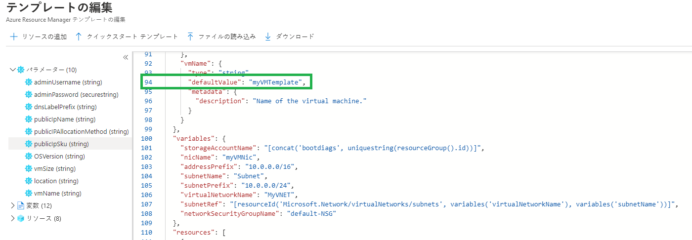
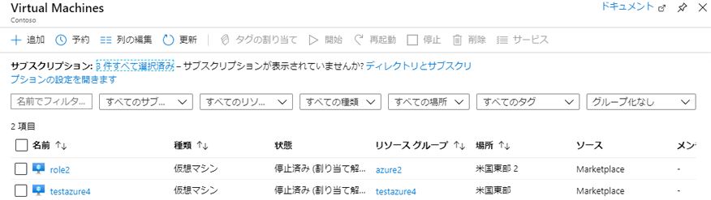
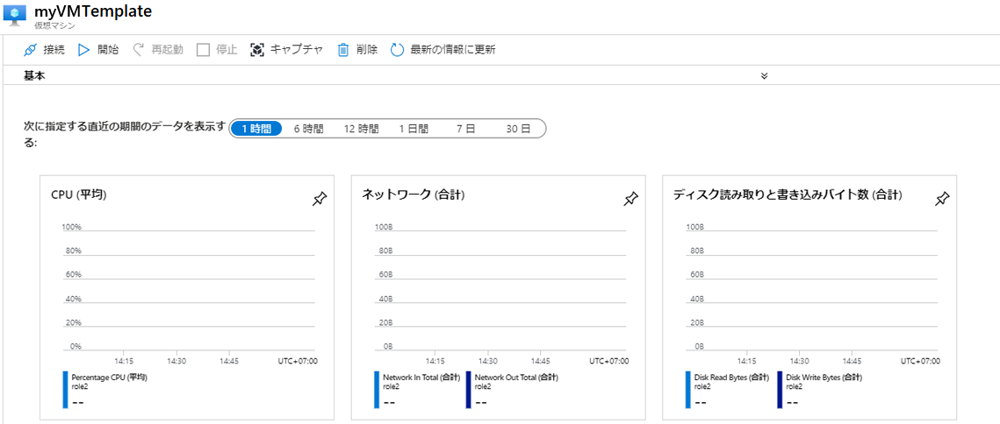

---
wts:
  title: 09 – テンプレートを使用して VM を作成する (10 分)
  module: 'Module 03: Describe core solutions and management tools'
---
# 09 – テンプレートを使用して VM を作成する (10 分)

このチュートリアルでは、QuickStart テンプレートを使用して仮想マシンをデプロイし、監視機能を調べます。

# タスク 1:QuickStart ギャラリーを探索し、テンプレートを見つける 

このタスクでは、Azure QuickStart ギャラリーを参照し、仮想マシンを作成するテンプレートをデプロイします。 

1. Within the lab environment, open a new browser window, and enter T <ph id="ph1">https://azure.microsoft.com/en-us/resources/templates/?azure-portal=true</ph>. In the gallery you will find a number of popular and recently updated templates. These templates automate deployment of Azure resources, including installation of popular software packages. Browse through the many different types of templates that are available.

3. **[基本的な Windows VM のデプロイ]** を選択します

4. Click the <bpt id="p1">**</bpt>Deploy to Azure<ept id="p1">**</ept> button. Your browser session will be automatically redirected to the <bpt id="p1">[</bpt>Azure portal<ept id="p1">](http://portal.azure.com/)</ept>.

  <bpt id="p1">**</bpt>Note<ept id="p1">**</ept>: The <bpt id="p2">**</bpt>Deploy to Azure<ept id="p2">**</ept> button enables you to deploy the template via the Azure portal. During such deployment, you will be prompted only for small set of configuration parameters. 

5. プロンプトが表示されたら、前の手順で指定した資格情報を使用して Azure サブスクリプションにサインインします。

6. Click <bpt id="p1">**</bpt>Edit template<ept id="p1">**</ept>. The Resource Manager template format uses the JSON format. Review the parameters and variables.  Then locate the parameter for virtual machine name. Change the name to <bpt id="p1">**</bpt>myVMTemplate<ept id="p1">**</ept>. <bpt id="p1">**</bpt>Save<ept id="p1">**</ept> your changes. 

    

7. Now configure the parameters required by the template (replace <bpt id="p1">***</bpt>xxxx<ept id="p1">***</ept> in the DNS label prefix with letters and digits such that the label is globally unique). Leave the defaults for everything else. 

    | 設定| 値|
    |----|----|
    | サブスクリプション | **提供された既定値を維持する**|
    | Resource group | **新しいリソース グループの作成** |
    | リージョン | 既定値を維持する |
    | 管理者ユーザー名 | **azureuser** |
    | 管理者パスワード | **Pa$$w0rd1234** |
    | DNS ラベルのプレフィックス | **myvmtemplatexxxx** |
    | OS バージョン | **2019-Datacenter** |

9. **[Review + Create](レビュー + 作成)** をクリックします。

10. デプロイを監視します。 

# タスク 2:仮想マシンのデプロイを確認および監視する

このタスクでは、正しくデプロイされた仮想マシンを確認します。 

1. **[すべてのサービス]** ブレードで、「**仮想マシン**」を検索して選択します。

2. 新しい仮想マシンが作成されたことを確認します。 

    

3. 仮想マシンを選択し、**[概要]** ウィンドウで、**[監視]** タブを選択し、下にスクロールして監視データを表示します。

    **注**:監視する時間枠は 1 時間から 30 日まで調整可能です。

4. **[CPU (平均)]**、**[ネットワーク (合計)]**、**[ディスク バイト (合計)]** を含むさまざまなグラフを確認します。 

    

5. ラボ環境内で、新しいブラウザー ウィンドウを開き、「T https://azure.microsoft.com/en-us/resources/templates/?azure-portal=true 」と入力します。

6. ギャラリーには、人気のあるテンプレートや最近更新されたテンプレートが多数あります。
7. これらのテンプレートを使用すると、一般的なソフトウェア パッケージのインストールを含む、Azure リソースのデプロイを自動化できます。 

8. **[フィルターの追加]** をクリックし、さまざまなイベントの種類と操作を検索してみます。 

    ![[イベントの種類] が選択された [フィルターの追加] ページのスクリーンショット。](../images/0904.png)

使用可能なさまざまな種類のテンプレートを参照します。

<bpt id="p1">**</bpt>Note<ept id="p1">**</ept>: To avoid additional costs, you can optionally remove this resource group. Search for resource groups, click your resource group, and then click <bpt id="p1">**</bpt>Delete resource group<ept id="p1">**</ept>. Verify the name of the resource group and then click <bpt id="p1">**</bpt>Delete<ept id="p1">**</ept>. Monitor the <bpt id="p1">**</bpt>Notifications<ept id="p1">**</ept> to see how the delete is proceeding.
