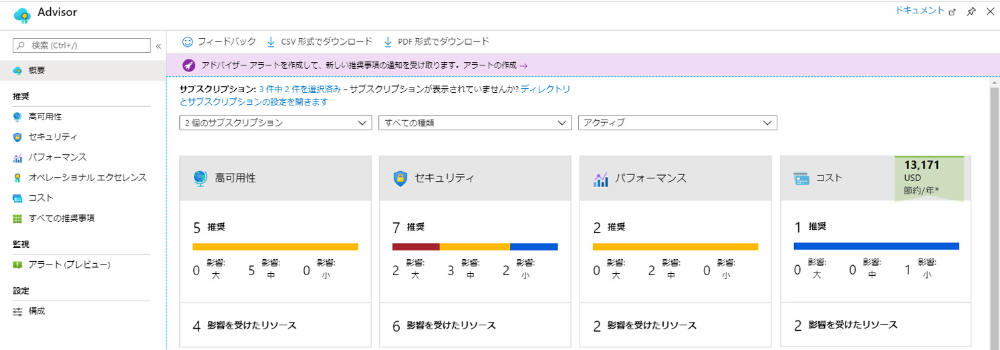

---
wts:
  title: 10 - PowerShell を使用して VM を作成する (10 分)
  module: 'Module 03: Describe core solutions and management tools'
---
# <a name="10---create-a-vm-with-powershell-10-min"></a>10 - PowerShell を使用して VM を作成する (10 分)

このチュートリアルでは、Cloud Shell を構成し、Azure PowerShell モジュールを使用してリソース グループと仮想マシンを作成し、Azure Advisor の推奨事項を確認します。 

# <a name="task-1-configure-the-cloud-shell"></a>タスク 1:Cloud Shell を設定する 

このタスクでは、Cloud Shell を構成します。 

1. [Azure portal](https://portal.azure.com) にサインインします。** ログイン資格情報は、[resources]\(リソース\) タブ (この [Instructions]\(手順\) タブのすぐ隣) にあります。 **
2. Azure portal から、右上にあるアイコンをクリックして、**Azure Cloud Shell** を開きます。

    

3. **Bash** や **PowerShell** のどちらかを選択するプロンプトが表示されたら、**PowerShell** を選択します。

4. **[ストレージにマウントされていない]** 画面で、**[詳細設定を表示]** を選択し、次の情報を入力します。

    | 設定 | 値 |
    |  -- | -- |
    | リソース グループ | **新しいリソース グループの作成** |
    | ストレージ アカウント (グローバルに一意の名前を使用して新しいアカウントを作成します (例: cloudshellstoragemystorage)) | **cloudshellxxxxxxx** |
    | ファイル共有 (新規作成) | **shellstorage** |

5. **[ストレージの作成]** を選択する

# <a name="task-2-create-a-resource-group-and-virtual-machine"></a>タスク 2:リソース グループと仮想マシンを作成する

このタスクでは、PowerShell を使用して、リソース グループと仮想マシンを作成します。  

1. Cloud Shell ペインの左上のドロップダウン メニューで、「**PowerShell**」が選択されていることを確認します。

2. Verify your new resource group by running the following command in the Powershell window. Press <bpt id="p1">**</bpt>Enter<ept id="p1">**</ept> to run the command.

    ```PowerShell
    Get-AzResourceGroup | Format-Table
    ```

3. 次のコマンドをターミナル ウィンドウに貼り付けて、仮想マシンを作成します。 

    ```PowerShell
    New-AzVm `
    -ResourceGroupName "myRGPS" `
    -Name "myVMPS" `
    -Location "East US" `
    -VirtualNetworkName "myVnetPS" `
    -SubnetName "mySubnetPS" `
    -SecurityGroupName "myNSGPS" `
    -PublicIpAddressName "myPublicIpPS"
    ```
    
4. プロンプトが表示されたら、ユーザー名 (**azureuser**) とパスワード (**Pa$$w0rd1234**) を入力します。これらは、その仮想マシンのローカル管理者アカウントとして構成されます。

5. VM が作成されたら、PowerShell セッションの CloudShell ペインを閉じます。

6. In the Azure portal, search for <bpt id="p1">**</bpt>Virtual machines<ept id="p1">**</ept> and verify the <bpt id="p2">**</bpt>myVMPS<ept id="p2">**</ept> is running. This may take a few minutes.

    

7. 新しい仮想マシンにアクセスし、[概要] と [ネットワーク] の設定を確認して、情報が正しくデプロイされたことを確認します。 

# <a name="task-3-execute-commands-in-the-cloud-shell"></a>タスク 3:Cloud Shell でコマンドを実行する

このタスクでは、Cloud Shell から PowerShell コマンドを実行する練習を行います。 

1. Azure portal から、右上にあるアイコンをクリックして、**Azure Cloud Shell** を開きます。

2. Cloud Shell ペインの左上のドロップダウン メニューで、「**PowerShell**」が選択されていることを確認します。

3. Retrieve information about your virtual machine including name, resource group, location, and status. Notice the PowerState is <bpt id="p1">**</bpt>running<ept id="p1">**</ept>.

    ```PowerShell
    Get-AzVM -name myVMPS -status | Format-Table -autosize
    ```

4. 次のコマンドを使用して、仮想マシンを停止します。 

    ```PowerShell
    Stop-AzVM -ResourceGroupName myRGPS -Name myVMPS
    ```
5. When prompted confirm (Yes) to the action. Wait for <bpt id="p1">**</bpt>Succeeded<ept id="p1">**</ept> status.

6. Verify your virtual machine state. The PowerState should now be <bpt id="p1">**</bpt>deallocated<ept id="p1">**</ept>. You can also verify the virtual machine status in the portal. Close Cloudshell.

    ```PowerShell
    Get-AzVM -name myVMPS -status | Format-Table -autosize
    ```

# <a name="task-4-review-azure-advisor-recommendations"></a>タスク 4:Azure Advisor の推奨事項を確認する

**注:** このタスクは、「Azure CLI を使用した VM の作成」ラボにあるタスクと同じです。 

このタスクでは、仮想マシンの Azure Advisor の推奨事項を確認します。 

1. **[すべてのサービス]** ブレードから、 **[アドバイザー]** を検索して選択します。 

2. On the <bpt id="p1">**</bpt>Advisor<ept id="p1">**</ept> blade, select <bpt id="p2">**</bpt>Overview<ept id="p2">**</ept>. Notice recommendations are grouped by Reliability, Security, Performance, and Cost. 

    

3. **[すべての推奨事項]** を選択し、各推奨事項と推奨されるアクションを表示します。 

    **注:**  リソースに応じて、推奨事項は異なります。 

    ![[アドバイザーすべての推奨事項] ページのスクリーンショット。 ](../images/1004.png)

4. 推奨事項を CSV または PDF ファイルとしてダウンロードできることを確認してください。 

5. アラートを作成できることを確認してください。 

6. 時間があれば、Azure PowerShell の試用を続けてください。 

Congratulations! You have configured Cloud Shell, created a virtual machine using PowerShell, practiced with PowerShell commands, and viewed Advisor recommendations.

<bpt id="p1">**</bpt>Note<ept id="p1">**</ept>: To avoid additional costs, you can optionally remove this resource group. Search for resource groups, click your resource group, and then click <bpt id="p1">**</bpt>Delete resource group<ept id="p1">**</ept>. Verify the name of the resource group and then click <bpt id="p1">**</bpt>Delete<ept id="p1">**</ept>. Monitor the <bpt id="p1">**</bpt>Notifications<ept id="p1">**</ept> to see how the delete is proceeding.
