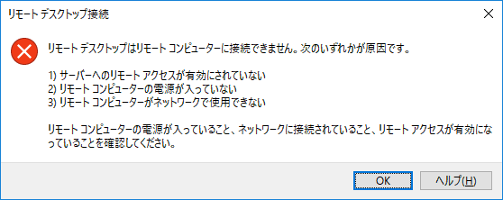

---
wts:
  title: 13 - セキュリティ保護されたネットワーク トラフィック (10 分)
  module: 'Module 04: Describe general security and network security features'
---
# 13 - セキュリティ保護されたネットワーク トラフィック (10 分)

このチュートリアルでは、ネットワーク セキュリティ グループを作成します。

# タスク 1:仮想マシンを作成する

このタスクでは、Windows Server 2019 Datacenter 仮想マシンを作成します。 

1. [Azure portal](https://portal.azure.com) にサインインします。

2. **[すべてのサービス]** ブレードで「**仮想マシン**」を検索して選択し、仮想マシンの **[+ 追加]、[+ 作成]、[+ 新規]** のいずれかをクリックします。

3. **[基本]** タブで、次の情報を入力します (その他の情報は既定値のままにします)。

    | 設定 | 値 |
    |  -- | -- |
    | サブスクリプション | **提供される既定値を使用する** |
    | Resource group | **新しいリソース グループの作成** |
    | 仮想マシン名 | **SimpleWinVM** |
    | リージョン | **(米国) 米国東部**|
    | Image | **Windows Server 2019 Datacenter Gen 2**|
    | サイズ | **Standard D2s v3**|
    | 管理者アカウントのユーザー名 | **azureuser** |
    | 管理者アカウントのパスワード | **Pa$$w0rd1234**|
    | 受信ポートの規則 | **なし**|

4. **[ネットワーク]** タブに切り替えて、次の設定を構成します。

    | 設定 | 値 |
    | -- | -- |
    | NIC ネットワーク セキュリティ グループ | **なし**|

5. **[管理]** タブに切り替え、 **[監視]** セクションで次の設定を選択します。

    | 設定 | 値 |
    | -- | -- |
    | ブート診断 | **無効化**|

6. その他の既定値はそのままにして、ページの下部にある **[確認および作成]** ボタンをクリックします。

7. Once Validation is passed click the <bpt id="p1">**</bpt>Create<ept id="p1">**</ept> button. It can take about five minutes to deploy the virtual machine.

8. Monitor the deployment. It may take a few minutes for the resource group and virtual machine to be created. 

9. デプロイ ブレードまたは通知領域から、 **[リソースに移動]** をクリックします。 

10. **[SimpleWinVM]** 仮想マシンブレードで **[ネットワーク]** をクリックし、 **[受信ポート規則]** タブを確認します。仮想マシンのネットワーク インターフェイスまたはネットワーク インターフェイスが接続されているサブネットに、ネットワーク セキュリティ グループが関連付けられていないことを確認してください。

    <bpt id="p1">**</bpt>Note<ept id="p1">**</ept>: Identify the name of the network interface. You will need it in the next task.

# タスク 2:ネットワーク セキュリティ グループを作成する

このタスクでは、ネットワーク セキュリティ グループを作成し、ネットワーク インターフェイスに関連付けます。 

1. **[すべてのサービス]** ブレードで、 **[ネットワーク セキュリティ グループ]** を検索して選択し、 **[+ 追加]、[+ 作成]、[+ 新規]** をクリックします。

2. **[ネットワークセキュリティグループの作成]** ブレードの **[基本]** タブで、次の設定を指定します。

    | 設定 | 値 |
    | -- | -- |
    | サブスクリプション | **既定のサブスクリプションを使用する** |
    | Resource group | **ドロップ ダウンから既定値を選択する** |
    | Name | **myNSGSecure** |
    | リージョン | **(米国) 米国東部**  |

3. **[確認と作成]** をクリックし、検証後、**[作成]** をクリックします。

4. NSG が作成されたら、 **[リソースに移動]** をクリックします。

5. **[設定]** の **[ネットワーク インターフェイス]** をクリックしてから、**[関連付け]** をクリックします。

6. 前のタスクで特定したネットワーク インターフェイスを選択します。 

# タスク 3:RDP を許可する受信セキュリティ ポートの規則を構成する

このタスクでは、受信セキュリティ ポートの規則を構成して、仮想マシンに RDP トラフィックを許可します。 

1. Azure portal で、**SimpleWinVM** 仮想マシンのブレードに移動します。 

2. **[概要]** ウィンドウで、 **[接続]** をクリックします。

3. Attempt to connect to the virtual machine by selecting RDP and downloading an running the RDP file. By default the network security group does not allow RDP. Close the error window. 

    

4. 仮想マシンのブレードで **[設定]** セクションまでスクロールし、 **[ネットワーク]** をクリックして、ネットワーク セキュリティ グループ **[myNSGSecure (ネットワーク インターフェイスに接続: myVMNic)]** の受信規則で、仮想ネットワーク内のトラフィックとロードバランサー プローブを除くすべての受信トラフィックを拒否していることを確認します。

5. On the <bpt id="p1">**</bpt>Inbound port rules<ept id="p1">**</ept> tab, click <bpt id="p2">**</bpt>Add inbound port rule<ept id="p2">**</ept> . Click <bpt id="p1">**</bpt>Add<ept id="p1">**</ept> when you are done. 

    | 設定 | 値 |
    | -- | -- |
    | source | **[任意]**|
    | Source port ranges | **\*** |
    | 到着地 | **[任意]** |
    | 宛先ポート範囲 | **3389** |
    | Protocol | **TCP** |
    | アクション | **許可** |
    | Priority | **300** |
    | Name | **AllowRDP** |

6. Select <bpt id="p1">**</bpt>Add<ept id="p1">**</ept> and wait for the rule to be provisioned and then try again to RDP into the virtual machine by going back to <bpt id="p2">**</bpt>Connect<ept id="p2">**</ept> This time you should be successful. Remember the user is <bpt id="p1">**</bpt>azureuser<ept id="p1">**</ept> and the password is <bpt id="p2">**</bpt>Pa$$w0rd1234<ept id="p2">**</ept>.

# タスク 4:インターネット アクセスを拒否するように送信セキュリティ ポートの規則を構成する

このタスクでは、インターネット アクセスを拒否する NSG 送信ポート規則を作成し、規則が機能していることを確認するためにテストします。

1. 仮想マシンへの RDP セッションを続行します。 

2. コンピューターが起動したら、**Internet Explorer** ブラウザーを開きます。 

3. Verify that you can access <bpt id="p1">**</bpt><ph id="ph1">https://www.bing.com</ph><ept id="p1">**</ept> and then close Internet Explorer. You will need to work through the IE enhanced security pop-ups. 

    **注**:送信インターネット アクセスを拒否するルールを構成します。 

4. Azure portal に戻り、**SimpleWinVM** 仮想マシンのブレードに戻ります。 

5. **[設定]** で **[ネットワーク]** をクリックし、 **[送信ポートの規則]** をクリックします。

6. Notice there is a rule, <bpt id="p1">**</bpt>AllowInternetOutbound<ept id="p1">**</ept>. This a default rule and cannot be removed. 

7. Click <bpt id="p1">**</bpt>Add outbound port rule<ept id="p1">**</ept> to the right of the <bpt id="p2">**</bpt>myNSGSecure  (attached to network interface: myVMNic)<ept id="p2">**</ept> network security group and configure a new outbound security rule with a higher priority that will deny internet traffic. Click <bpt id="p1">**</bpt>Add<ept id="p1">**</ept> when you are finished. 

    | 設定 | 値 |
    | -- | -- |
    | source | **[任意]**|
    | Source port ranges | **\*** |
    | 到着地 | **サービス タグ** |
    | 宛先サービス タグ | **Internet** |
    | 宛先ポート範囲 | **\*** |
    | Protocol | **TCP** |
    | アクション | **Deny** |
    | 優先順位 | **4000** |
    | Name | **DenyInternet** |

8. **[追加]** をクリックして、RDP の VM に戻ります。 

9. Browse to <bpt id="p1">**</bpt><ph id="ph1">https://www.microsoft.com</ph><ept id="p1">**</ept>. The page should not display. You may need to work through additional IE enhanced security pop-ups.  

<bpt id="p1">**</bpt>Note<ept id="p1">**</ept>: To avoid additional costs, you can optionally remove this resource group. Search for resource groups, click your resource group, and then click <bpt id="p1">**</bpt>Delete resource group<ept id="p1">**</ept>. Verify the name of the resource group and then click <bpt id="p1">**</bpt>Delete<ept id="p1">**</ept>. Monitor the <bpt id="p1">**</bpt>Notifications<ept id="p1">**</ept> to see how the delete is proceeding.
