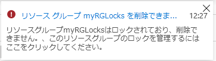
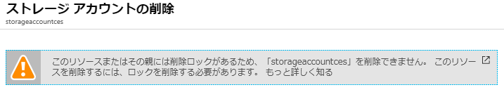

---
wts:
  title: 15 - リソース ロックの管理 (5 分)
  module: 'Module 05: Describe identity, governance, privacy, and compliance features'
---
# 15 - リソース ロックの管理 (5 分)

In this walkthrough, we will add a lock to the resource group and test deleting the resource group. Locks can be applied in a subscription to resource groups, or individual resources to prevent accidental deletion or modification of critical resources.  

# タスク 1:リソース グループにロックを追加し、削除をテストする

このタスクでは、リソース グループにリソース ロックを追加し、リソース グループの削除をテストします。 

1. [Azure portal](https://portal.azure.com) にサインインします。

2. Azure portal で、**myRGLocks** リソース グループに移動します。

3. サブスクリプション、リソース グループ、または個々のリソースにロックを適用して、重要なリソースが誤って削除または変更されるのを防ぐことができます。 

4. **[設定]** セクションで、**[ロック]** をクリックし、**[+ 追加]** をクリックします。 

    ![[ロック] ウィンドウが表示されている myRGLocks リソース グループのスクリーンショット。](../images/1601.png)

5. Configure the new lock. When you are done click <bpt id="p1">**</bpt>OK<ept id="p1">**</ept>. 

    | 設定 | 値 |
    | -- | -- |
    | ロック名 | '''RGLock''' |
    | ロックの種類 | **削除** |
    | | |

6. Click <bpt id="p1">**</bpt>Overview<ept id="p1">**</ept> and click <bpt id="p2">**</bpt>Delete resource group<ept id="p2">**</ept>. Type the name of the resource group and click <bpt id="p1">**</bpt>OK<ept id="p1">**</ept>. You receive an error message stating the resource group is locked and can't be deleted.

    

# タスク 2:リソース グループのメンバーの削除をテストする

このタスクでは、リソース ロックがリソース グループのストレージ アカウントを保護するかどうかをテストします。 

1. **[すべてのサービス]** ブレードで「**ストレージ アカウント**」を検索して選択し、**[+ 追加]、[+ 作成]、[+ 新規]** のいずれかをクリックします。 

2. このチュートリアルでは、リソース グループにロックをかけた後、リソース グループを削除できるかテストします。

    | 設定 | 値 | 
    | --- | --- |
    | サブスクリプション | **サブスクリプションを選択します** |
    | Resource group | **myRGLocks** |
    | ストレージ アカウント名 | **storageaccountxxxx** |
    | 場所 | **(米国) 米国東部**  |
    | パフォーマンス | **Standard** |
    | アカウントの種類 | **StorageV2 (汎用 v2)** |
    | レプリケーション | **ローカル冗長ストレージ (LRS)** |
    | アクセス層 (既定) | **ホット** |
   

3. **[確認と作成]** をクリックして、ストレージ アカウントの設定を確認し、Azure が構成を検証できるようにします。 

4. サブスクリプションにおいては、リソース グループ、または個々のリソースにロックをかけることで、重要なリソースが誤って削除または変更されるのを防ぐことができます。 

5.  ストレージ アカウントが正常に作成されたことを示す通知を待ちます。 

6. Access your new storage account and from the <bpt id="p1">**</bpt>Overview<ept id="p1">**</ept> pane, click <bpt id="p2">**</bpt>Delete<ept id="p2">**</ept>. You receive an error message stating the resource or its parent has a delete lock. 

    

    <bpt id="p1">**</bpt>Note<ept id="p1">**</ept>: Although we did not create a lock specifically for the storage account, we did create a lock at the resource group level, which contains the storage account. As such, this <bpt id="p1">*</bpt>parent<ept id="p1">*</ept> level lock prevents us from deleting the resource and the storage account inherits the lock from the parent.

# タスク 3:リソース ロックを解除する

このタスクでは、リソースロックを解除してテストします。 

1. **[myRGLocks-XXXXXXXX]** リソース グループ ブレードに戻り、**[設定]** セクションで **[ロック]** をクリックします。
    
2. **[myRGLocks-XXXXXXXX]** エントリの右端 (**[編集]** の右側) にある **[削除]** リンクをクリックします。

    ![[削除] リンクが強調表示されたロックのスクリーンショット。](../images/1604.png)

3. ストレージ アカウント ブレードに戻り、リソースを削除できるようになったことを確認します。

Congratulations! You created a resource group, added a lock to resource group and tested deletion, tested deleting a resource in the resource group, and removed the resource lock. 

<bpt id="p1">**</bpt>Note<ept id="p1">**</ept>: To avoid additional costs, you can optionally remove this resource group. Search for resource groups, click your resource group, and then click <bpt id="p1">**</bpt>Delete resource group<ept id="p1">**</ept>. Verify the name of the resource group and then click <bpt id="p1">**</bpt>Delete<ept id="p1">**</ept>. Monitor the <bpt id="p1">**</bpt>Notifications<ept id="p1">**</ept> to see how the delete is proceeding.
