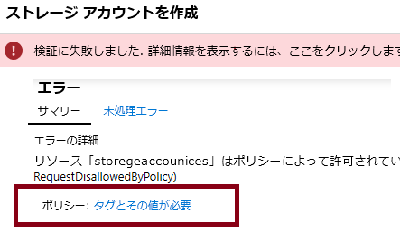
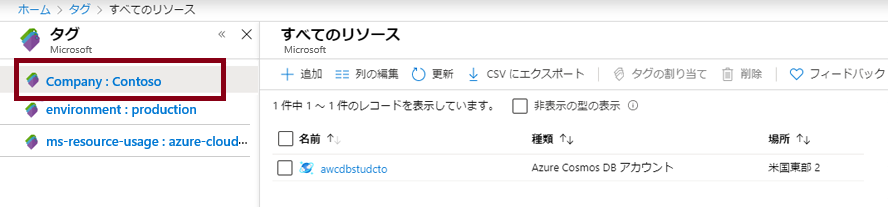

---
wts:
  title: 16 – リソースのタグ付けを実装する (5 分)
  module: 'Module 05: Describe identity, governance, privacy, and compliance features'
---
# 16 – リソースのタグ付けを実装する (5 分)

このチュートリアルでは、タグ付けが必要なポリシー割り当てを作成し、ストレージ アカウントを作成してタグ付けをテストし、指定したタグを持つリソースを表示し、タグ付けポリシーを削除します。

# タスク 1:ポリシー割り当てを作成する 

このタスクでは、**[リソースでタグを必須にする]** ポリシーを構成して、そのポリシーをサブスクリプションに割り当てます。 

1. [Azure portal](https://portal.azure.com) にサインインします。

2. **[すべてのサービス]** ブレードで、「**ポリシー**」を検索して選択します。

3. **[作成]** セクションにスクロールして **[割り当て]** をクリックし、ページの上部から **[ポリシーの割り当て]** をクリックします。

4. ポリシーの**範囲**はサブスクリプション全体になります。 

5. Under <bpt id="p1">**</bpt>Basics<ept id="p1">**</ept> Select the <bpt id="p2">**</bpt>Policy definition<ept id="p2">**</ept> ellipsis button (right side of textbox). In the <bpt id="p1">**</bpt>Search<ept id="p1">**</ept> box, enter the value <bpt id="p2">**</bpt>tag<ept id="p2">**</ept>. A list of related Policies with the word <bpt id="p1">**</bpt>tag<ept id="p1">**</ept> will appear. Scroll down till you find the <bpt id="p1">**</bpt>Require a tag and its value on resources<ept id="p1">**</ept> definition, click on it and click <bpt id="p2">**</bpt>Select<ept id="p2">**</ept>.

   
   
6.  On the <bpt id="p1">**</bpt>Parameters<ept id="p1">**</ept> tab, type in **Company : Contoso ** for the tag key/value pair name. Click <bpt id="p1">**</bpt>Review + create<ept id="p1">**</ept>, and then <bpt id="p2">**</bpt>Create<ept id="p2">**</ept>.

  

7. The <bpt id="p1">**</bpt>Require a tag amd its value on resources<ept id="p1">**</ept> policy assignment is now in place. When a resource is created, it must include a tag with the Company : Contoso key.
   <bpt id="p1">**</bpt>Note - you need to wait up to 30 minutes for the Policy to be applied.<ept id="p1">**</ept> 

  

# タスク 2:ストレージアカウントを作成して、必要なタグ付けをテストする

このタスクでは、ストレージ アカウントを作成して、必要なタグ付けをテストします。 

1. Azure portal の **[すべてのサービス]** ブレードで、「**ストレージ アカウント**」を検索して選択し、**[+ 追加]、[+ 新規]、[+ 作成]** のいずれかをクリックします。

2. On the <bpt id="p1">**</bpt>Basics<ept id="p1">**</ept> tab of the <bpt id="p2">**</bpt>Create storage account<ept id="p2">**</ept> blade, fill in the following information (replace <bpt id="p3">**</bpt>xxxx<ept id="p3">**</ept> in the name of the storage account with letters and digits such that the name is globally unique). Leave the defaults for everything else.

    | 設定 | 値 | 
    | --- | --- |
    | サブスクリプション | **提供される既定値を使用する** |
    | Resource group | **新しいリソース グループの作成** |
    | ストレージ アカウント名 | **storageaccountxxxx** |
    | 場所 | **(米国) 米国東部** |

3. **[Review + create](レビュー + 作成)** をクリックします。 

    <bpt id="p1">**</bpt>Note:<ept id="p1">**</ept> We are testing to see what happens when the tag is not supplied. Please note, it can take up to 30 minutes for Policies to take effect.

4. You will receive a Validation failed message. Click the <bpt id="p1">**</bpt>Click here to view details<ept id="p1">**</ept> message. On the <bpt id="p1">**</bpt>Errors<ept id="p1">**</ept> blade, on the <bpt id="p2">**</bpt>Summary<ept id="p2">**</ept> tab note the error message stating that resource was disallowed by Policy.

    **注:** [未処理エラー] タブを表示すると、必要な特定のタグ名が表示されます。 

    

5. Close the <bpt id="p1">**</bpt>Error<ept id="p1">**</ept> pane and click <bpt id="p2">**</bpt>Previous<ept id="p2">**</ept> (bottom of the screen). Provide the tagging information. 

    | 設定 | 値 | 
    | --- | --- |
    | タグ名 | **Company:Contoso** (ドロップダウン リストにない可能性があります) |

6. Click <bpt id="p1">**</bpt>Review + create<ept id="p1">**</ept> and verify that the validation was successful. Click <bpt id="p1">**</bpt>Create<ept id="p1">**</ept> to deploy the storage account. 

# タスク 3:特定のタグを持つすべてのリソースを表示します

1. Azure Portal の **[すべてのサービス]** ブレードで、「**タグ**」を検索して選択します。

2. Note all tags and their values. Click the <bpt id="p1">**</bpt>Company : Contoso<ept id="p1">**</ept> key/value pair. This will display a blade showing the newly created storage account, as long as you included the tag during its deployment. 

   

3. ポータルで、**[すべてのリソース]** ブレードを表示します。

4. Click <bpt id="p1">**</bpt>Add filter<ept id="p1">**</ept> and add the <bpt id="p2">**</bpt>Company<ept id="p2">**</ept> tag key as the filter category. With the filter applied, only your storage account will be listed.

    ![[Company] が選択されている [すべてのリソース] フィルターのスクリーンショット。](../images/1706.png)

# タスク 4:ポリシーの割り当てを削除する

このタスクでは、**[リソースでタグを必須にする]** ポリシーを削除して、今後の作業に影響が及ばないようにします。 

1. ポータルの **[すべてのサービス]** ブレードで、「**ポリシー**」を検索して選択します。

2. **[リソースでタグを必須にする]** ポリシー エントリをクリックします。

3. 上部のメニューから **[割り当ての削除]** をクリックします。

4. **[はい]** をクリックして、**[割り当ての削除]** ダイアログでポリシー割り当ての削除を確定します

5. 時間があれば、タグなしで別のリソースを作成し、ポリシーが適用されていないことを確認してください。

**[基本]** で、**[ポリシー定義]** 省略記号ボタン (テキストボックスの右側にあります) を選択します。

**[検索]** ボックスに、「**tag**」と入力します。
