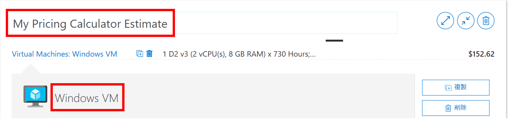
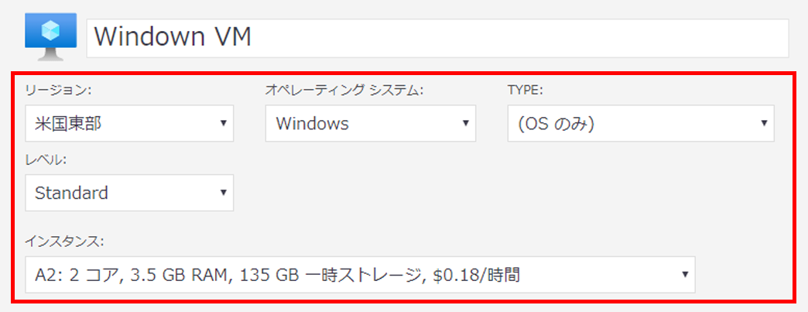
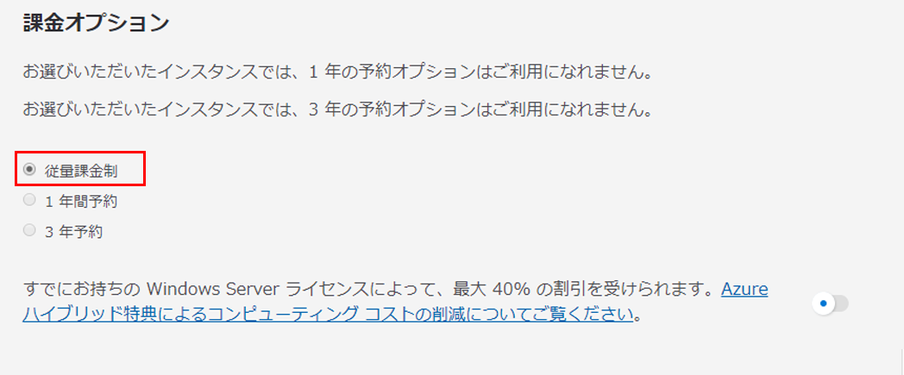
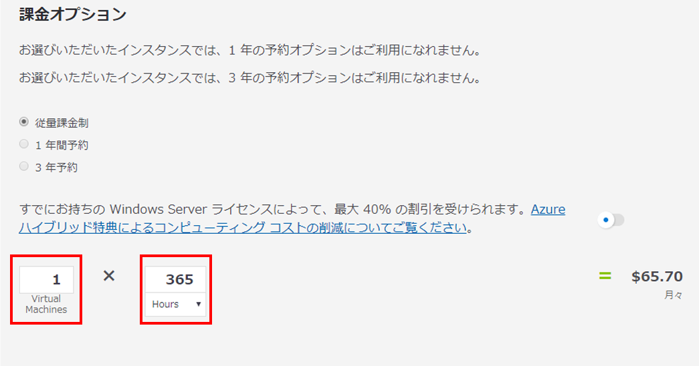
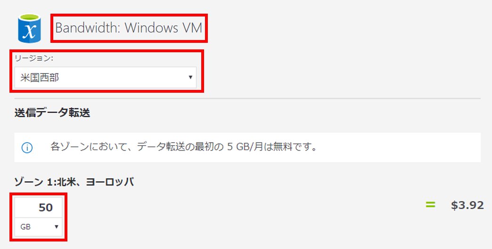
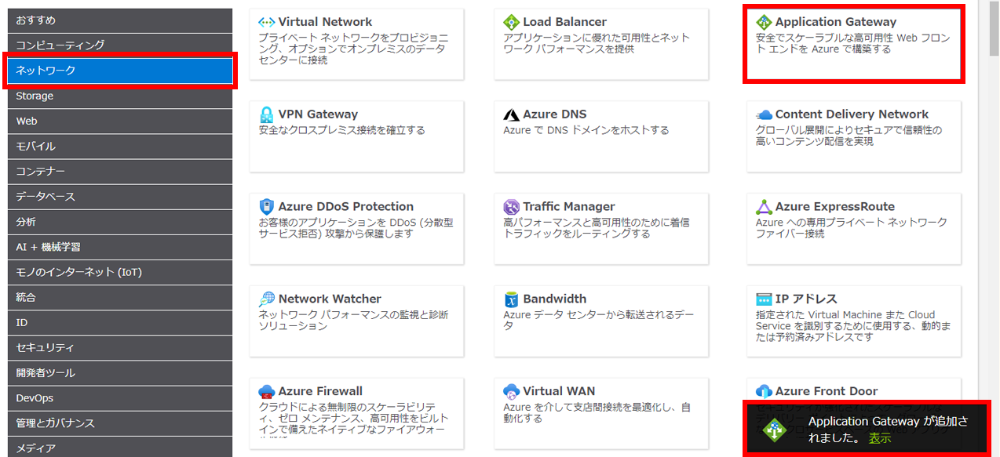
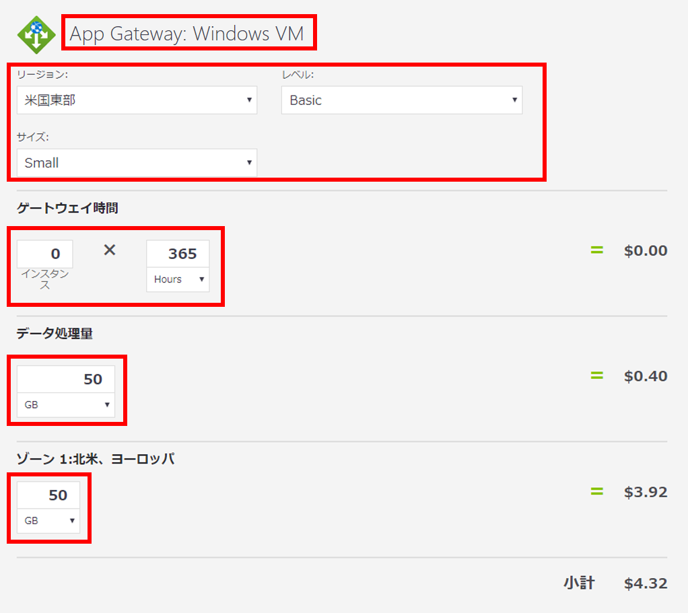
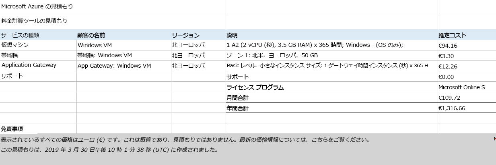

---
wts:
  title: 19 - Azure 料金計算ツールを使用する (10 分)
  module: 'Module 06: Describe Azure cost management and service level agreements'
---
# 19 - 料金計算ツールを使用する (10 分)

このチュートリアルでは、Azure 料金計算ツールを使用して、Azure 仮想マシンおよび関連するネットワーク リソースのコスト見積もりを作成します。

# タスク 1:料金計算ツールについて理解する

このタスクでは、Azure 料金計算ツールを使用してサンプルのインフラストラクチャのコストを見積もります。 

<bpt id="p1">**</bpt>Note<ept id="p1">**</ept>: To create an Azure Pricing Calculator estimate, this walkthrough provides example configurations for the VM and related resources. Use this example configurations or provide the Azure Pricing Calculator with details of your <bpt id="p1">*</bpt>actual<ept id="p1">*</ept> resource requirements instead.

1. ブラウザーで、Azure [料金計算ツール](https://azure.microsoft.com/en-us/pricing/calculator/)の Web ページに移動します。

2. VM 構成の詳細を追加するには、 **[製品]** タブの **[仮想マシン]** をクリックします。下にスクロールして、仮想マシンの詳細を表示します。 

3. Replace <bpt id="p1">**</bpt>Your Estimate<ept id="p1">**</ept> and <bpt id="p2">**</bpt>Virtual Machines<ept id="p2">**</ept> text with more descriptive names for your Azure Pricing Calculator estimate and your VM configuration. This walkthrough example uses <bpt id="p1">**</bpt>My Pricing Calculator Estimate<ept id="p1">**</ept> for the estimate, and <bpt id="p2">**</bpt>Windows VM<ept id="p2">**</ept> for the VM configuration.

   

4. 既定の VM 構成を変更します。

    | 設定 | 値 |
    | -- | -- |
    | リージョン | **北ヨーロッパ** |
    | オペレーティング システム | **Windows** |
    | 型 | **[(OS のみ)]** |
    | サービス レベル | **Standard** |  
    | インスタンス | **[A2:2 コア数、3.5 GB の RAM、135 GB の一時ストレージ]** |

   

    <bpt id="p1">**</bpt>Note<ept id="p1">**</ept>: The VM instance specifications and pricing may differ from those in this example. Follow this walkthrough by choosing an instance that matches the example as closely as possible. To view details about the different VM product options, choose <bpt id="p1">**</bpt>Product details<ept id="p1">**</ept> from the <bpt id="p2">**</bpt>More info<ept id="p2">**</ept> menu on the right.

5. **[課金オプション]** を **[従量課金制]** に設定します。

   

6. **注**:このチュートリアルでは、Azure 料金計算ツールの見積もりを作成するために、VM および関連リソースの構成例を示します。

    VM の数を「`1`」に設定したままにして、月の時間の値を「`365`」に変更します。

   

7. **[管理 OS ディスク]** で、既定の VM 記憶域の構成を変更します。

    | レベル | ディスク サイズ | ディスクの数 | スナップショット | ストレージ トランザクション |
    | ---- | --------- | --------------- | -------- | -------------------- |
    | Standard HDD | S30: 1024 GiB | 1 | オフ | 10,000 |

   

8. To add networking bandwidth to your estimate, go to the top of the Azure Pricing Calculator webpage. Click <bpt id="p1">**</bpt>Networking<ept id="p1">**</ept> in the product menu on the left, then click the <bpt id="p2">**</bpt>Bandwidth<ept id="p2">**</ept> tile. In the <bpt id="p1">**</bpt>Bandwidth added<ept id="p1">**</ept> message dialog, click <bpt id="p2">**</bpt>View<ept id="p2">**</ept>.

   

9. **[見積もり]** と **[仮想マシン]** テキストに、Azure 料金計算ツールの見積もりと VM 構成に関するより詳細な記述名を入力します。

    | リージョン | ゾーン 1 送信データ転送 |
    | ------ | -------------------------------------- |
    | 北ヨーロッパ | 50 GB |

   

10. To add an Application Gateway, return to the top of the Azure Pricing Calculator webpage. In the <bpt id="p1">**</bpt>Networking<ept id="p1">**</ept> product menu, click the <bpt id="p2">**</bpt>Application Gateway<ept id="p2">**</ept> tile. In the <bpt id="p1">**</bpt>Application Gateway<ept id="p1">**</ept> message dialog, click <bpt id="p2">**</bpt>View<ept id="p2">**</ept>.

    

11. 強調表示されている見積もり名と VM 構成名は、Azure の料金計算ツールの見積もりに見積もり名と VM 構成名を追加する方法を示します。

    | 設定 | 値 |
    | -- | -- |
    | リージョン | **北ヨーロッパ** |
    | レベル | **Basic** |
    | サイズ | **Small** |
    | インスタンス | **1** |  
    | 時間 | **365** |
    | データ処理量 | **50 GB** |
    | ゾーン 1:北米、ヨーロッパ | **50 GB**|

    

# タスク 2:料金の見積もりを確認する

このタスクでは、Azure 料金計算ツールの結果を確認します。 

1. Azure 料金計算ツール Web ページの最下部にスクロールし、合計 **[推定月額費用]** を表示します。

    <bpt id="p1">**</bpt>Note<ept id="p1">**</ept>: Explore the various options available within the Azure Pricing Calculator. For example, this walkthrough requires you to update the currency to Euro.

2. 通貨をユーロに変更し、 **[エクスポート]** を選択して、Microsoft Excel (`.xlsx`) 形式でオフラインで表示するための見積もりのコピーをダウンロードします。

    

    

Congratulations! You downloaded an estimate from the Azure Pricing Calculator.
